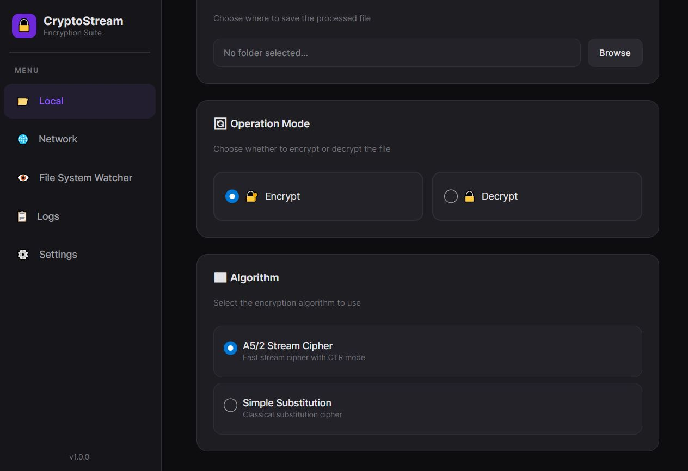
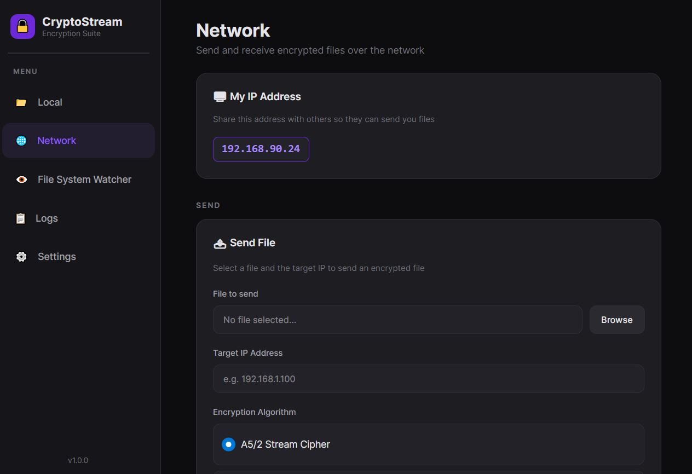
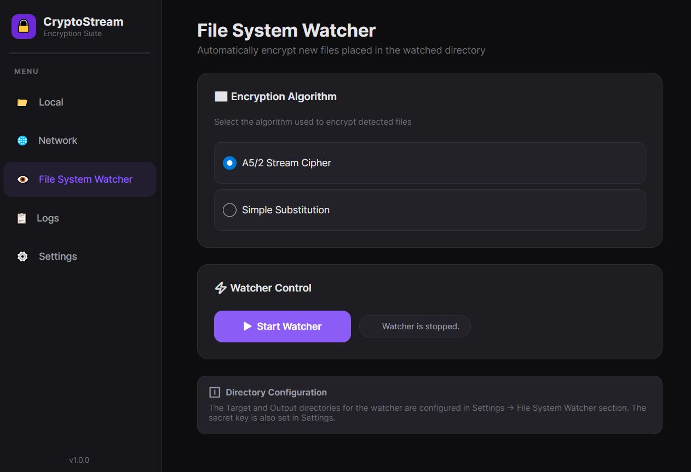
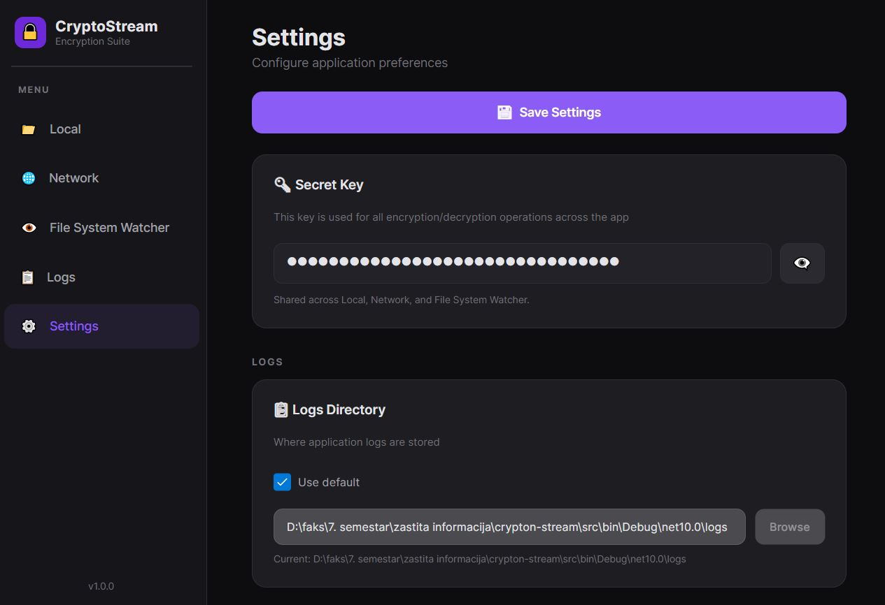

<h1 align="center">Crypton Stream 🔐</h1>

[](https://dotnet.microsoft.com/)
[](https://avaloniaui.net/)
[](https://learn.microsoft.com/en-us/dotnet/csharp/)

**Crypton Stream** is a cross-platform desktop application for secure file encryption, decryption, and transfer, built with **.NET 10** and **Avalonia UI**. It supports two cipher algorithms, encrypted file transfer over TCP, and an automatic file system watcher that encrypts new files on the fly. File integrity is verified using MD5 hashing embedded in a custom binary file format.

<br>

## ✨ Features

- **🔐 Local Encryption & Decryption** — Encrypt files using A5/2 or Simple Substitution. Algorithm is auto-detected from the file header during decryption.
- **📡 Network Transfer** — Send encrypted files over TCP. The receiving side automatically decrypts and verifies integrity.
- **📂 File System Watcher** — Monitor a folder and automatically encrypt any new file dropped into it.
- **✅ Integrity Verification** — MD5 hash is embedded in the file header and verified on decryption to detect tampering or corruption.
- **📋 Logging** — All operations are logged with timestamps for full audit trail visibility.

<br>

## 🛠️ Architecture

- **MVVM** pattern with Avalonia UI and CommunityToolkit.Mvvm
- **Strategy Pattern** — `ICryptoStrategy` interface abstracts encryption algorithms, allowing runtime swapping
- **Factory Pattern** — `CryptoStrategyFactory` creates the correct strategy based on algorithm selection (encryption) or file metadata (decryption)

<br>

## 🔧 Algorithms

### A5/2 Stream Cipher (CTR Mode)

Implemented with four LFSRs (19, 22, 23, 17 bits) with R4 as the clocking controller. Used in **CTR mode** — a random 10-bit nonce is generated per file, and the data is split into 4 KB segments each with a unique frame number. Segments are encrypted **in parallel** since CTR mode allows independent processing. When the counter overflows (every ~16 MB), a new nonce is derived via FNV-1a hashing.

### Simple Substitution

A byte-level monoalphabetic substitution cipher with a 256-byte table derived from the secret key. Decryption uses the inverse table. Processes data in 16 MB chunks — the entire table fits in L1 cache.

### MD5 Integrity

Custom streaming MD5 implementation integrated via `MD5StreamWrapper` — a Stream decorator that computes the hash transparently as data flows during encryption/decryption.

<br>

## 🚀 Getting Started

**Prerequisites:** [.NET 10 SDK](https://dotnet.microsoft.com/en-us/download/dotnet/10.0)

```bash
git clone https://github.com/bxgda/crpyton-stream.git
cd crpyton-stream/src
dotnet run
```

<br>

## 📸 Screenshots

<p align="center">
  
  
  
  
  
</p>

##

### Elektronski fakultet Univerziteta u Nišu
smer: računarstvo i informatika<br/>
semestar: 7
